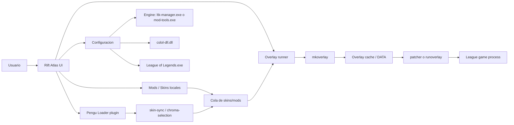
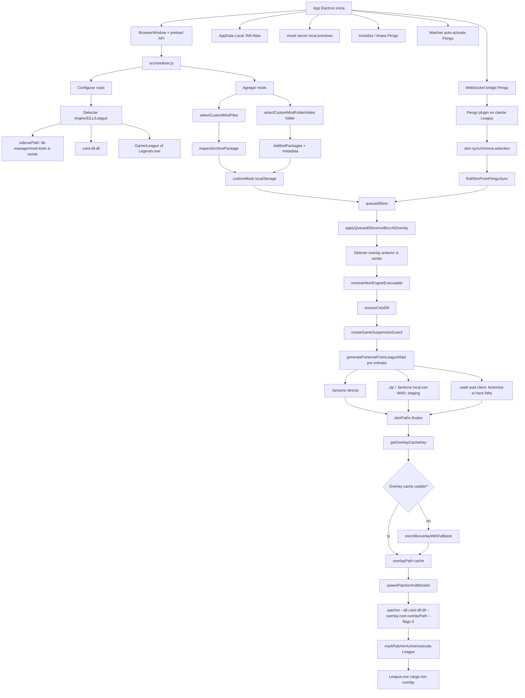
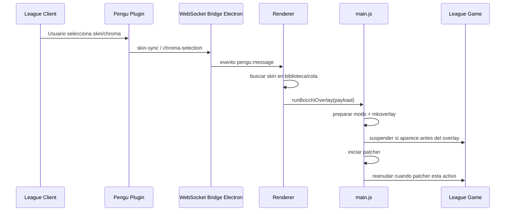
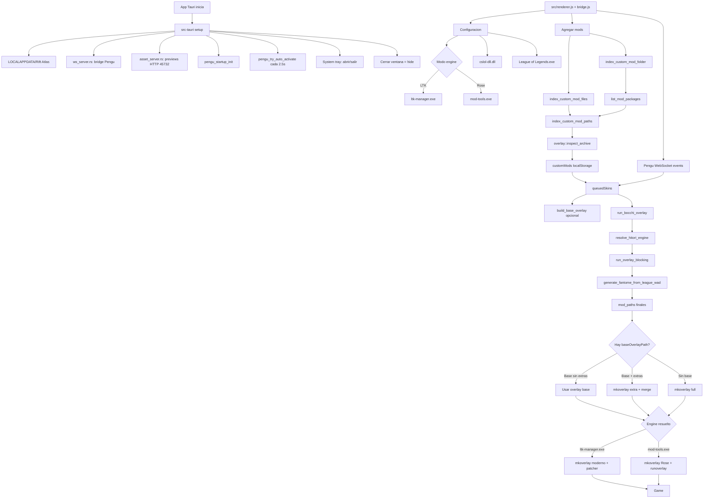
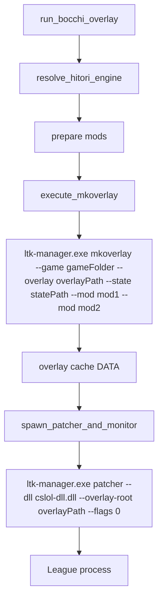
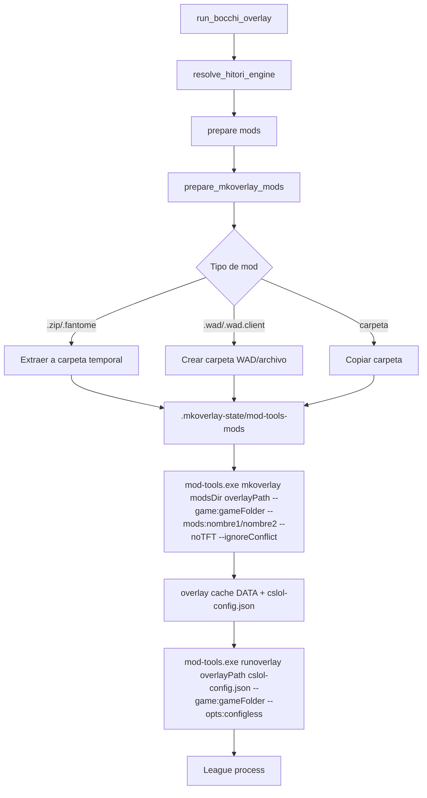
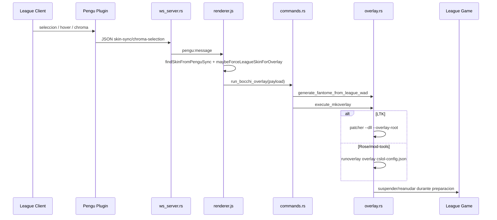
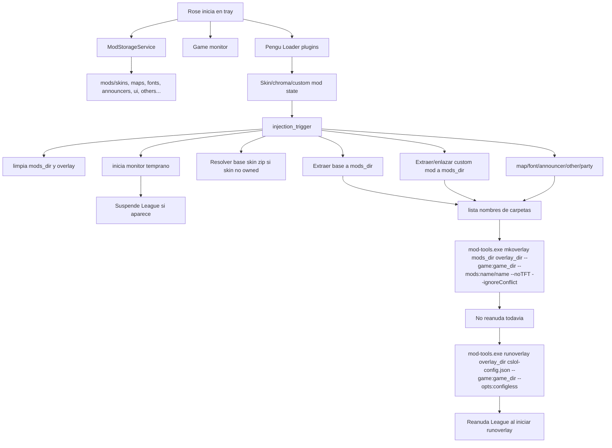
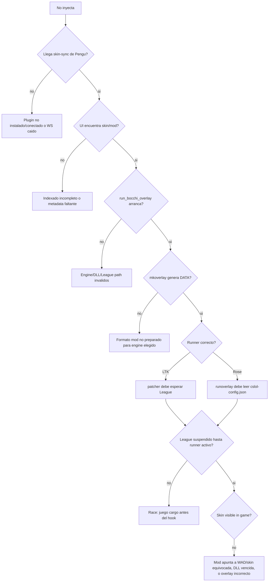

# Rift Atlas overlay/plugin flow comparison

Este documento compara el flujo observado en:

- Original Electron: `C:\Users\BRIAN\Desktop\proyectoLOL`
- Tauri actual: `C:\Users\BRIAN\Desktop\proyectoLOLTauri`
- Referencia Rose: `Alban1911/Rose`, para el modo `mod-tools.exe`

## Mapa General

## Original Electron

### Original: Flujo De Plugin Pengu

### Original: Caracteristicas Clave

- Electron mantiene handles directos del proceso `patcherProcess`, stdin/stdout/stderr y eventos `exit/error`.
- El log de overlay se escribe a `last-overlay-log.txt` y el renderer lo usa para diagnostico.
- El watcher de suspension arranca temprano y sigue mirando mientras se prepara el overlay.
- El flujo observado prioriza `patcher --dll --overlay-root`, estilo LTK/cslol DLL.
- La UI original no tenia un selector visual fuerte de modo `LTK` vs `Rose`; era mas implicito por ruta/engine.

## Tauri Actual

### Tauri Actual: Modo LTK

### Tauri Actual: Modo Rose / mod-tools

### Tauri Actual: Plugin Pengu

## Rose De Referencia

## Diferencias Principales

| Area | Original Electron | Tauri actual | Rose |
|---|---|---|---|
| UI engine | Implicito/simple | Conmutador `LTK` / `Rose` | No selector de LTK, usa `mod-tools.exe` interno |
| Plugin League | Pengu + WS bridge | Pengu + `ws_server.rs` | Pengu + backend Python |
| Asset/previews | File URLs / Electron | HTTP local `127.0.0.1:45732` | Archivos internos Rose |
| Mods por archivo | Inspecciona archiveInfo | Inspecciona archiveInfo | Storage por categorias |
| Mods por carpeta | Lista + metadata | Ahora lista + metadata completa | Storage categorizado |
| Engine LTK | `mkoverlay` moderno + `patcher` | Igual | No aplica |
| Engine Rose | No era flujo principal | `mkoverlay` Rose + `runoverlay` | Flujo principal |
| Preparacion mod-tools | No central | Extrae/copia a `mod-tools-mods` | Extrae/enlaza a `mods_dir` |
| Suspension de League | Guard temprano y persistente | Guard temprano/persistente | Monitor dedicado muy agresivo |
| Estado proceso | Electron guarda `ChildProcess` | Tauri guarda PID + atomic exit flag | psutil/process manager |
| Logs | `last-overlay-log.txt` | `last-overlay-log.txt` + memoria UI | logs Python |
| Cerrar app | Ocultar a tray en Electron | Ocultar a tray en Tauri | Tray app |

## Puntos Donde Pueden Aparecer Bugs

## Checklist De Diagnostico

1. Confirmar en configuracion si esta seleccionado `LTK` o `Rose`.
2. Confirmar que el binario real coincide:
   - `LTK`: `ltk-manager.exe`
   - `Rose`: `mod-tools.exe` real de cslol-manager, no una copia de LTK.
3. Revisar `C:\Users\BRIAN\AppData\Local\Rift Atlas\last-overlay-log.txt`.
4. Buscar estas lineas:
   - `run_bocchi_overlay: INICIO`
   - `Mods preparados`
   - `mkoverlay timeout`
   - `execute_mkoverlay completado`
   - `Iniciando overlay engine`
   - `[PATCHER] Initialized. Waiting for game...` o salida de `runoverlay`
5. Si falla Rose/mod-tools, revisar que el staging tenga carpetas bajo:
   - `cslol-profiles/.mkoverlay-state/mod-tools-mods`
6. Si falla LTK, revisar que `overlayPath/DATA` exista y tenga `.wad.client`.
